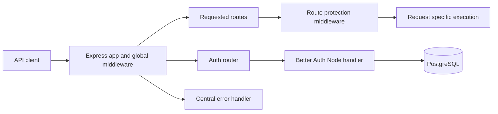

# Application Architecture

## Purpose

This repository is an HTTP API. It composes an Express application with authentication routes set up. Better Auth handles authentication and uses PostgreSQL for persistence. The project builds to a native ESM Node.js application and includes unit and HTTP integration tests.

## Tech Stack

| Area | Technology | Role |
| --- | --- | --- |
| Runtime | Node.js 22+ | Runs the API; CI currently validates on Node.js 22. |
| Language and modules | TypeScript 5+, ES2024, native ESM | Strictly typed application code and Node-compatible output. |
| HTTP | Express 5 | Application composition, routing, and middleware. |
| Authentication and persistence | Better Auth, PostgreSQL via `pg` | Authentication endpoints and their database connection. |
| Request middleware | `cors`, `morgan`, `cookie-parser`, `express-validator` | Cross-origin configuration, request logging, cookie parsing, and validation support. |
| Development and build | `tsx`, TypeScript, `tsc-alias` | Watch-mode development, compilation, and compiled alias rewriting. |
| Tests | Jest 30, `ts-jest` | TypeScript unit and integration tests in Node.js. |

## System Overview

The application is composed in `src/app.ts`: global middleware runs before the root endpoint and mounted routers, and the centralized error handler is registered last. `src/index.ts` starts the HTTP server. Authentication requests are delegated to Better Auth, which is configured with a PostgreSQL pool.

## Core Layout

| Path | Responsibility |
| --- | --- |
| `src/app.ts` | Composes the Express app, root timestamp endpoint, routers, and final error handler. |
| `src/index.ts` | Starts the HTTP server using the configured port. |
| `src/config/` | Loads environment settings and configures the Express app and global middleware. |
| `src/routes/` | Declares endpoints and connects middleware, controllers, or external handlers. |
| `src/controllers/` | Implements request and response behavior. |
| `src/middlewares/` | Implements reusable request processing, handler wrappers, and centralized error handling. |
| `src/validators/` | Defines reusable `express-validator` chains and validation middleware. |
| `src/lib/` | Configures integrations such as Better Auth and contains runtime assets such as `status.html`. |
| `src/types/` | Declares shared Express and environment types. |
| `tests/unit/` | Tests individual controllers, middleware, and handlers. |
| `tests/integration/` | Tests the composed Express app over HTTP. |

## Request Lifecycle

1. `src/config/app.config.ts` creates the Express app and registers CORS, Morgan request logging, cookie parsing, JSON parsing, and URL-encoded body parsing.
2. `src/app.ts` registers the root endpoint, mounts `/system` and `/auth`, then registers the centralized error handler.
3. `GET /system/health` passes through `protectSystem`, the controller wrapper, and `getStatus`, which serves `src/lib/status.html`.
4. Requests under `/auth` are forwarded to Better Auth's Node handler. Better Auth uses the PostgreSQL pool configured in `src/lib/auth.ts`.
5. Controller and middleware wrappers forward thrown or rejected errors with `next(error)`. The error handler logs the error and returns a generic 500 response; if response headers have already been sent, it delegates to Express.

## Configuration and Build

- `src/config/env.config.ts` loads `.env` when present; otherwise it loads `.env.<NODE_ENV>`, defaulting to `.env.development` when `NODE_ENV` is unset.
- `src/types/env.d.ts` describes environment values for TypeScript. This type declaration does not parse or validate runtime values.
- `tsconfig.json` enables strict checking, targets ES2024, emits ESM to `dist/`, and defines aliases such as `@route/*` and `@middleware/*`.
- `package.json` declares `"type": "module"`. `npm run build` compiles with `tsc`, rewrites aliases with `tsc-alias`, then copies runtime assets.
- `npm run dev` runs `tsx watch src/index.ts`. `npm start` builds the project and starts `dist/src/index.js`.

## Tests and Delivery

- Jest runs TypeScript tests in the Node environment using the ESM `ts-jest` preset. `jest.config.ts` maps source aliases for tests.
- CI runs on pushes and pull requests. It installs dependencies with `npm ci`, then runs `npm run typecheck`, `npm test -- --runInBand`, and `npm run build` on Node.js 22.
- CD runs on pushes to any branch or manual dispatch. It packages the compiled app and production dependencies as a GitHub Actions artifact retained for 14 days. This workflow does not deploy to a hosting provider.
